<!-- llms.txt
AI AGENTS: DartSort pipeline documentation.
- Section 2: Full pipeline overview with decision-point flowchart
- Section 3.X: Individual stage reference (7 stages + embedded featurization)
- Section 4: Configuration reference with bidirectional mapping
- Section 5: Data flow, HDF5 storage, and checkpoint/resume logic
- Section 7: Control flow decisions — all conditional branches
- Section 8: AI guidance — invariants, glossary, refactoring targets
-->

# DartSort Pipeline Reference

*Motion-aware spike sorting — architecture & internals*

---

## 2. Pipeline Overview

### What DartSort Does

DartSort is a spike sorting pipeline for extracellular electrophysiology. It takes a multi-channel neural recording and produces sorted spike trains — each spike assigned to a putative neuron (unit). Key differentiators:

- **Motion-aware:** Probe drift correction is a first-class operation, applied before clustering and maintained throughout template matching.
- **GPU-accelerated:** PyTorch operations throughout for detection, featurization, clustering, and template matching.
- **Iterative template matching:** Detect → cluster → estimate templates → match → recluster → update templates → match again. Each iteration refines spike assignments.

### Entry Points

The pipeline has two entry points in `main.py`:

- `dartsort()` (`main.py:79-201`) — user-facing API. Handles config conversion, preprocessing, tmpdir management, and error trapping.
- `_dartsort_impl()` (`main.py:204-419`) — internal implementation with all pipeline logic.

### Full Pipeline Flowchart

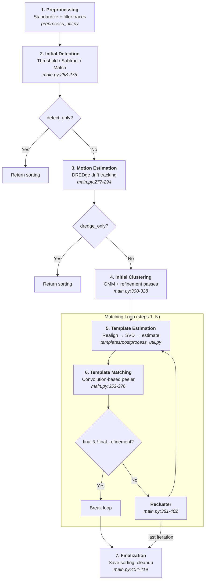

### Execution Model

The pipeline is **iterative**. After initial detection and clustering, it enters a matching loop (`main.py:334-402`) that runs `matching_iterations` times (default: configurable, typically 1-3). Each iteration: estimate templates from current labels → match templates against the full recording → recluster the combined spike set → repeat. This converges toward stable unit assignments.

---

## 3. Stage-by-Stage Reference

### Stage 1: Preprocessing

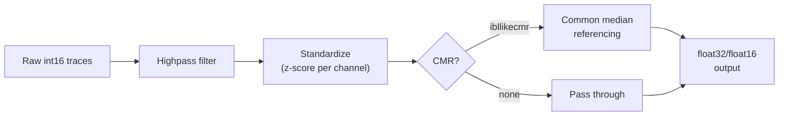

#### Inputs

| Name | Type | Description |
|------|------|-------------|
| `recording` | `BaseRecording` | SpikeInterface recording object (any format) |

#### Outputs

| Name | Type | Description |
|------|------|-------------|
| `recording` | `BaseRecording` | Standardized, filtered recording in float32 or float16 |

#### Algorithm

Standardizes raw voltage traces via z-score normalization per channel, applies highpass filtering, and optionally applies common median referencing (CMR) or spatial highpass filtering. The output dtype is configurable.

#### Key Files

- `util/preprocess_util.py` — `preprocess()` function
- `main.py:133` — invocation in pipeline

#### Configuration

| Parameter | Type | Default | Description |
|-----------|------|---------|-------------|
| `preprocessing` | `str` | `"ibllikecmr"` | Strategy: `ibllikecmr`, `ibllike`, `standardize`, `none` |
| `preprocessing_dtype` | `str` | `"float32"` | `float16` or `float32` |

#### Design Rationale

DartSort expects standardized input (not raw int16 data). Preprocessing normalizes SNR units across channels, which is required for consistent threshold-based detection downstream. IBL-style CMR removes correlated noise across channels.

#### Preconditions

None — this is the first stage. The recording must be a valid SpikeInterface `BaseRecording`.

---

### Stage 2: Initial Detection

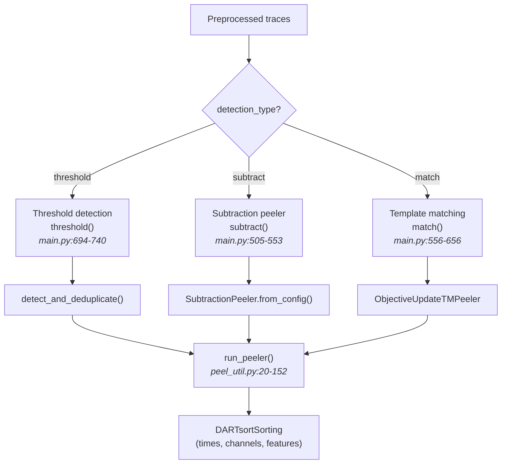

#### Inputs

| Name | Type | Description |
|------|------|-------------|
| `recording` | `BaseRecording` | Preprocessed recording |
| `cfg` | `DARTsortInternalConfig` | Pipeline configuration |
| `motion` | `MotionInfo \| None` | Optional precomputed motion |

#### Outputs

| Name | Type | Description |
|------|------|-------------|
| `sorting` | `DARTsortSorting` | Detected spikes with times, channels, and initial features |

#### Algorithm

Dispatches to one of three detection methods based on `cfg.detection_type`. All three ultimately produce a `DARTsortSorting` via `run_peeler()` (`peel_util.py:20-152`):

1. **Threshold** (`main.py:694-740`): Simple amplitude-based peak detection with temporal/spatial deduplication. Creates a `Threshold` peeler.
2. **Subtraction** (`main.py:505-553`): Iteratively detects and subtracts spikes from the residual. Creates a `SubtractionPeeler`. Supports `fit_only` mode.
3. **Template matching** (`main.py:556-656`): Matches against a template library (requires precomputed templates or a prior sorting). Creates an `ObjectiveUpdateTemplateMatchingPeeler`.

#### Key Files

- `main.py:258-275` — initial detection invocation and `detect_only` early exit
- `main.py:422-449` — `initial_detection()` function
- `peel/threshold.py` — `Threshold` class
- `peel/subtract.py` — `SubtractionPeeler` class
- `peel/matching.py` — `ObjectiveUpdateTemplateMatchingPeeler`
- `peel_util.py:20-152` — `run_peeler()` orchestration
- `detect/detect.py` — `detect_and_deduplicate()`

#### Configuration

| Parameter | Type | Default | Description |
|-----------|------|---------|-------------|
| `detection_type` | `str` | `"subtract"` | `threshold`, `subtract`, or `match` |
| `voltage_threshold` | `float` | `3.0` | SNR threshold in standard deviations |
| `peak_sign` | `str` | `"neg"` | `neg`, `pos`, or `both` |
| `ms_before` | `float` | `1.4` | Waveform snippet before peak (ms) |
| `ms_after` | `float` | `2.6` | Waveform snippet after peak (ms) |
| `detect_only` | `bool` | `False` | Exit pipeline after detection |

#### Design Rationale

Three detection methods serve different use cases: threshold is fastest, subtraction handles overlapping spikes by iteratively removing them, and template matching uses prior knowledge for maximum accuracy in later iterations. All share the same peeler interface for composability.

#### Preconditions

Recording must be preprocessed (standardized). If `detection_type == "match"`, precomputed templates or a prior sorting must be available.

---

### Stage 3: Motion Estimation

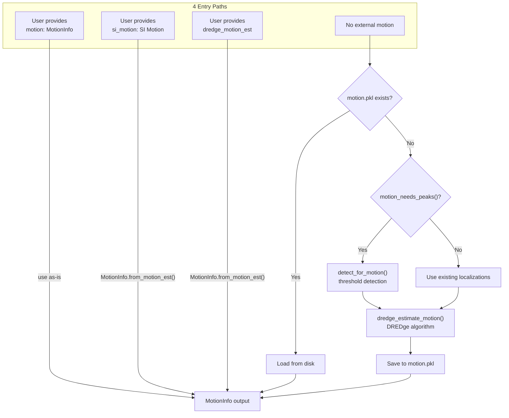

#### Inputs

| Name | Type | Description |
|------|------|-------------|
| `sorting` | `DARTsortSorting` | Detected spikes with localizations |
| `recording` | `BaseRecording` | Preprocessed recording |
| `motion` | `MotionInfo \| None` | Optional user-provided motion |
| `si_motion` | `SI Motion \| None` | Optional SpikeInterface Motion object |
| `dredge_motion_est` | `MotionEstimate \| None` | Optional DREDge MotionEstimate |

#### Outputs

| Name | Type | Description |
|------|------|-------------|
| `motion` | `MotionInfo` | Displacement vs. time along the probe axis |

#### Algorithm

Estimates probe drift over time using spike localizations. The DREDge algorithm bins spikes temporally and spatially, then estimates displacement per time bin. The resulting `MotionInfo` object is used for motion-corrected feature extraction downstream.

There are **4 alternative entry paths** (see diagram above), resolved at `main.py:227-252`:

1. User provides `motion: MotionInfo` directly → use as-is
2. User provides `si_motion: SpikeInterface Motion` → convert via `MotionInfo.from_motion_est()`
3. User provides `dredge_motion_est: DREDge MotionEstimate` → convert via `MotionInfo.from_motion_est()`
4. No external motion → DartSort estimates internally via `get_motion_info()`

#### Key Files

- `main.py:277-294` — motion estimation invocation
- `main.py:227-252` — 4-path motion resolution at resume time
- `util/motion.py` — `MotionInfo` class, `get_motion_info()`
- `main_util.py` — `motion_needs_peaks()`

#### Configuration

| Parameter | Type | Default | Description |
|-----------|------|---------|-------------|
| `do_motion_estimation` | `bool` | `True` | Enable/disable motion estimation |
| `dredge_only` | `bool` | `False` | Exit pipeline after motion estimation (`main.py:296-298`) |
| `motion_estimation_cfg` | `MotionEstimationConfig` | — | DREDge-specific parameters |

#### Design Rationale

Motion estimation happens **after** initial detection but **before** clustering. This ordering is an invariant: spatial correction must occur before feature extraction for correct unit separation. Users can bypass estimation entirely by providing precomputed motion.

---

### Stage 4: Clustering

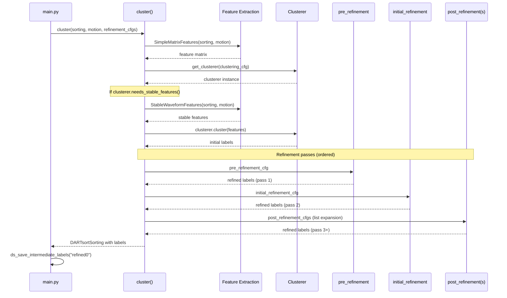

#### Inputs

| Name | Type | Description |
|------|------|-------------|
| `recording` | `BaseRecording` | Preprocessed recording |
| `sorting` | `DARTsortSorting` | Detected spikes with features |
| `motion` | `MotionInfo` | Motion estimate for spatial correction |
| `clustering_cfg` | `ClusteringConfig` | Clustering algorithm parameters |
| `clustering_features_cfg` | `ClusteringFeaturesConfig` | Feature extraction parameters |
| `refinement_cfgs` | `list[RefinementConfig]` | Ordered list of refinement passes |

#### Outputs

| Name | Type | Description |
|------|------|-------------|
| `sorting` | `DARTsortSorting` | Sorting with unit labels assigned |

#### Algorithm

The `cluster()` function (`main.py:743-801`) performs:

1. **Feature extraction** (`main.py:761-768`): Create `SimpleMatrixFeatures` from spike data using PCA + localizations.
2. **Get clusterer** (`main.py:770-778`): Factory method `get_clusterer()` selects algorithm (default: iterative split-merge GMM).
3. **Stable features** (`main.py:779-788`): Created only if `clusterer.needs_stable_features()` — used for motion-aware refinement.
4. **Run clustering** (`main.py:790-796`): `clusterer.cluster()` returns updated sorting with labels.
5. **GPU cleanup** (`main.py:799`)

#### Refinement Loop Internals

The multi-pass refinement architecture is controlled by `_matching_step_cfgs()` (`main.py:349-351`), which returns `(clus_cfg, clfeat_cfg, ref_cfgs, feat_cfg, samp_cfg)`:

- **Initial clustering (step 0)** uses 3 refinement passes (`main.py:300-305`):
  1. `pre_refinement_cfg` — pre-processing refinement
  2. `initial_refinement_cfg` — main refinement
  3. `*post_refinement_cfgs` — post-processing refinement(s) (list expansion)

- **Matching step clustering** varies by context (`main.py:381-402`):
  - Final step + subsampling + TMM → 1 pass (`agglomerate_cfg` only)
  - Other steps → 3 passes (pre, refinement, agglomerate)

- The `recluster_after_first_matching` flag controls whether clustering runs after matching step 1.

#### Key Files

- `main.py:300-328` — initial clustering invocation
- `main.py:381-402` — matching-step clustering
- `main.py:743-801` — `cluster()` internals
- `main.py:349-351` — `_matching_step_cfgs()`
- `clustering/clustering.py` — main clustering logic, `get_clusterer()`, `RecursiveHDBSCANClusterer`, `ScikitLearnClusterer`
- `clustering/mixture.py` — Gaussian mixture models
- `clustering/agglomerate.py` — hierarchical clustering
- `clustering/merge.py` — cluster merging
- `clustering/density.py` — `DensityPeaksClusterer`
- `clustering/kmeans.py` — KMeans variants
- `clustering/forward_backward.py` — forward-backward algorithm

#### Configuration

| Parameter | Type | Default | Description |
|-----------|------|---------|-------------|
| `clustering_cfg` | `ClusteringConfig` | — | Algorithm parameters (min_cluster_size, etc.) |
| `pre_refinement_cfg` | `RefinementConfig` | — | Pre-processing refinement pass |
| `initial_refinement_cfg` | `RefinementConfig` | — | Main refinement pass |
| `post_refinement_cfgs` | `list[RefinementConfig]` | — | Post-processing refinement passes |
| `recluster_after_first_matching` | `bool` | `False` | Run clustering after matching step 1 |

---

### Stage 5: Template Estimation

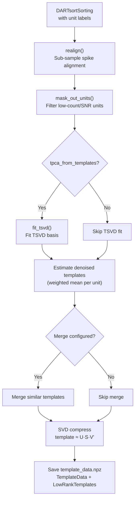

#### Inputs

| Name | Type | Description |
|------|------|-------------|
| `sorting` | `DARTsortSorting` | Sorting with unit labels |
| `recording` | `BaseRecording` | Preprocessed recording |
| `motion` | `MotionInfo` | Motion correction |

#### Outputs

| Name | Type | Description |
|------|------|-------------|
| `template_data` | `TemplateData` | Contains `LowRankTemplates` and `CompressedUpsampledTemplates` |
| `sorting` | `DARTsortSorting` | Updated sorting (units may be filtered/merged) |

#### Algorithm

`estimate_template_library()` in `templates/postprocess_util.py`:

1. **Realign**: Sub-sample spike alignment for accurate template averaging.
2. **Filter**: `mask_out_units()` removes units below minimum count or SNR thresholds.
3. **TSVD fit**: If `tpca_from_templates`, fit temporal SVD basis from template waveforms.
4. **Estimate**: Compute weighted mean waveform per unit (the template).
5. **Merge**: Optionally merge templates with high similarity.
6. **SVD compress**: Each template is approximated as `U @ S @ V.T`, keeping top-k singular vectors. This reduces storage and enables efficient convolution-based matching.

#### Key Files

- `templates/postprocess_util.py` — `estimate_template_library()`
- `templates/templates.py` — `TemplateData` class
- `templates/template_util.py` — SVD compression, upsampling
- `templates/realignment.py` — sub-sample alignment
- `templates/get_templates.py` — extract templates from units
- `main.py:588-624` — template estimation within `match()`

#### Configuration

| Parameter | Type | Default | Description |
|-----------|------|---------|-------------|
| `matching_cfg.min_template_ptp` | `float` | — | Filter templates by peak-to-peak amplitude |
| `matching_cfg.min_template_snr` | `float` | — | Filter templates by signal-to-noise ratio |
| `matching_cfg.min_template_count` | `int` | — | Filter templates by spike count |
| `matching_cfg.precomputed_templates_npz` | `str \| None` | `None` | Path to pre-fit templates (skip estimation) |

#### Design Rationale

SVD compression is a memory/performance invariant: templates must be compressed before matching. The matching peeler expects `LowRankTemplates` for efficient convolution. Template upsampling enables sub-sample-precision spike time alignment.

---

### Stage 6: Template Matching

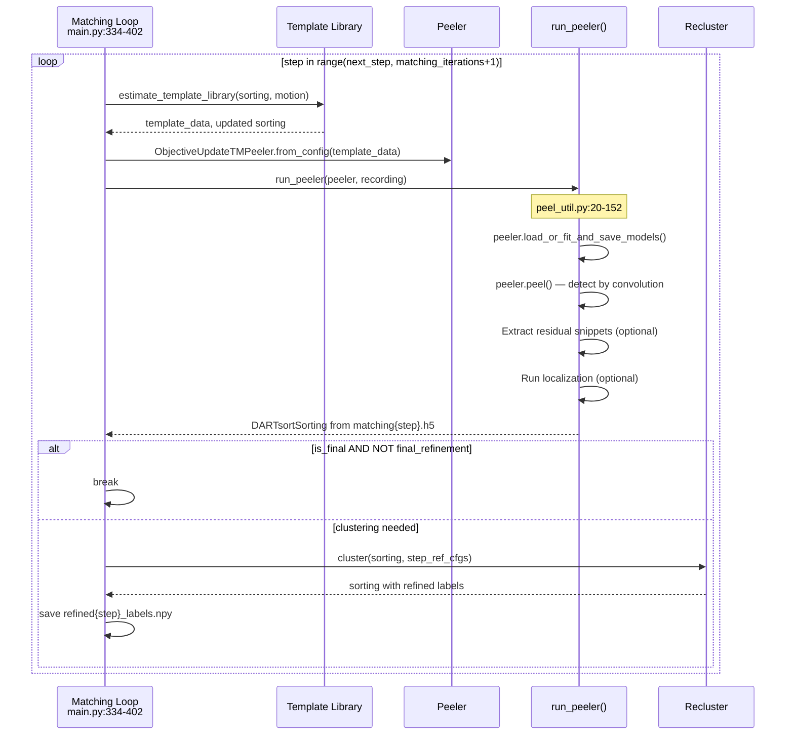

#### Inputs

| Name | Type | Description |
|------|------|-------------|
| `sorting` | `DARTsortSorting` | Current sorting with labels from previous step |
| `recording` | `BaseRecording` | Preprocessed recording |
| `motion` | `MotionInfo` | Motion correction |
| `matching_cfg` | `MatchingConfig` | Matching parameters |

#### Outputs

| Name | Type | Description |
|------|------|-------------|
| `sorting` | `DARTsortSorting` | Updated sorting with new detections from template matching |

#### Algorithm

The matching loop (`main.py:334-402`) iterates `range(next_step, matching_iterations + 1)`. For each step:

1. **Template estimation** (`main.py:588-624`): Build template library from current labels (skipped if `precomputed_templates_npz` is set).
2. **Peeler creation** (`main.py:626-635`): Create `ObjectiveUpdateTemplateMatchingPeeler`.
3. **run_peeler()** (`peel_util.py:20-152`):
   - Check if already done via `peeler_is_done()` (`peel_util.py:65-77`)
   - `peeler.load_or_fit_and_save_models()` (`peel_util.py:83-88`)
   - `peeler.peel()` — convolve templates with traces, threshold, subtract matched spikes (`peel_util.py:108-120`)
   - Extract residual snippets if configured (`peel_util.py:121-135`)
   - Run localization if configured (`peel_util.py:138-150`)
   - Return `DARTsortSorting.from_peeling_hdf5()`
4. **Early exit** (`main.py:378-379`): If final step and `not cfg.final_refinement`, break.
5. **Recluster** (`main.py:381-402`): If clustering is configured for this step, recluster and save labels.

#### Key Files

- `main.py:334-402` — matching loop
- `main.py:556-656` — `match()` function
- `peel/matching.py` — `ObjectiveUpdateTemplateMatchingPeeler`
- `peel_util.py:20-152` — `run_peeler()`
- `peel/matching_util/` — pairwise convolution, template matching utilities

#### Configuration

| Parameter | Type | Default | Description |
|-----------|------|---------|-------------|
| `matching_iterations` | `int` | configurable | Number of matching rounds |
| `matching_threshold` | `float` | `8.0` | Detection threshold for matches |
| `final_refinement` | `bool` | `True` | Cluster after final matching step |
| `matching_cfg.delete_pconv` | `bool` | `True` | Delete pconv.h5 after use |

#### Design Rationale

Convolution-based matching is computationally efficient on GPU using compressed template representations (`CompressedPairwiseConv`). The objective function measures residual norm reduction: a spike is "matched" if placing a template at that time/channel reduces the total residual energy. Iterating improves recall as reclustered templates better represent the true signal.

---

### Stage 7: Refinement & Output

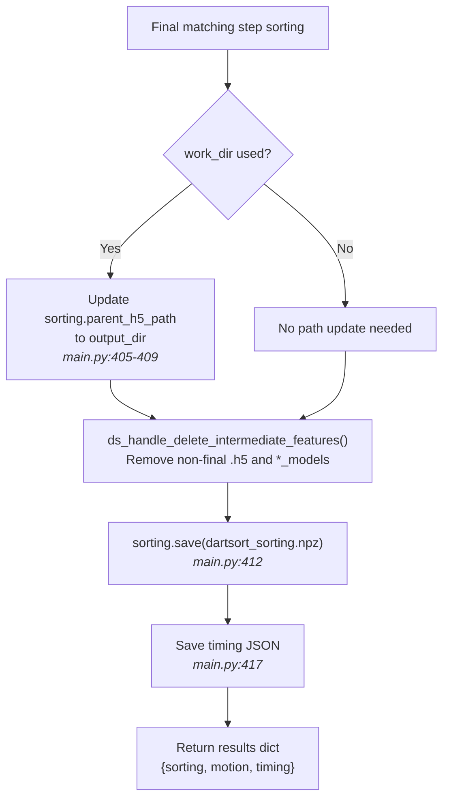

#### Inputs

| Name | Type | Description |
|------|------|-------------|
| `sorting` | `DARTsortSorting` | Final sorting after last matching/clustering iteration |

#### Outputs

| Name | Type | Description |
|------|------|-------------|
| `dartsort_sorting.npz` | file | Serialized spike train (times_samples, channels, labels) |
| `matchingN.h5` | file | HDF5 with all spike features |
| `motion.pkl` | file | Serialized MotionInfo |
| `timing.json` | file | Per-stage timing data |

#### Algorithm

Finalization (`main.py:404-419`):

1. If tmpdir was used, patch `sorting.parent_h5_path` to point to output_dir (the tmpdir is about to be cleaned up).
2. Delete intermediate features if configured via `ds_handle_delete_intermediate_features()`.
3. Save final sorting to `dartsort_sorting.npz`.
4. Save timing information.
5. Return results dict with sorting, motion, and timing.

#### Export Formats

`DARTsortSorting` supports multiple export formats:

- `.to_numpy_sorting()` → SpikeInterface `NumpySorting`
- `.to_tsgroup()` → Pynapple `TsGroup`
- `.to_pandas()` → Pandas DataFrame
- Phy export via SpikeInterface bridge

#### Key Files

- `main.py:404-419` — finalization logic
- `util/data_util.py` — `DARTsortSorting` class
- `main_util.py` — `ds_handle_delete_intermediate_features()`

---

### Featurization & Localization (embedded within peelers)

> **Note:** Featurization is **not** a standalone pipeline stage — it occurs within the peelers during detection and matching via the `WaveformPipeline`. The actual top-level pipeline flow is: Detection → Motion → Clustering → [Matching Loop] → Finalize. Featurization happens inside `run_peeler()` at `peel_util.py:108-150`, where waveform transforms (PCA, localization, denoising) are applied to detected spikes as part of the peeling process.

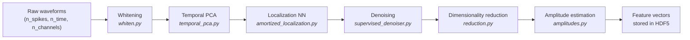

#### Inputs

| Name | Type | Description |
|------|------|-------------|
| `waveforms` | `float32[n_spikes, n_time, n_channels]` | Raw waveform snippets around detected peaks |
| `motion` | `MotionInfo` | Drift correction for spatial features |

#### Outputs

| Name | Type | Description |
|------|------|-------------|
| `point_source_localizations` | `float32[n_spikes, 4]` | (x, y, z, alpha) spike positions |
| `collisioncleaned_waveforms` | `float32[n_spikes, n_time, n_channels]` | Denoised waveforms |
| `features_pca` | `float32[n_spikes, n_components]` | PCA-reduced features for clustering |

#### Algorithm

Featurization is a composable `WaveformPipeline` of transformers, each with `.fit()`, `.transform()`, and `.fit_transform()` methods. The pipeline chains: whitening (decorrelate channels via noise covariance) → temporal PCA (reduce time dimension, e.g. 121 timepoints → 20 PCs) → neural-net localization (pretrained on simulated data, predicts x/y/z/alpha) → denoising → dimensionality reduction → amplitude estimation.

This pipeline is invoked inside `run_peeler()` (`peel_util.py:108-150`) during both initial detection and template matching stages, not as a separate top-level pipeline step.

#### Key Files

- `peel_util.py:108-150` — featurization invocation within `run_peeler()`
- `transform/pipeline.py` — `WaveformPipeline` orchestrator
- `transform/amortized_localization.py` — `AmortizedLocalization` neural net
- `transform/temporal_pca.py` — `TemporalPCA`
- `transform/whiten.py` — `Whitener`
- `transform/supervised_denoiser.py` — supervised denoising
- `transform/reduction.py` — dimensionality reduction
- `transform/amplitudes.py` — amplitude estimation

#### Configuration

| Parameter | Type | Default | Description |
|-----------|------|---------|-------------|
| `featurization_cfg.do_localization` | `bool` | `True` | Run localization neural net |
| `featurization_cfg.tpca_from_templates` | `bool` | `False` | Fit TPCA basis from templates instead of data |
| `featurization_cfg.denoise_only` | `bool` | `False` | Skip localization, only denoise |

#### Design Rationale

Neural-net localization over analytical methods: the pretrained NN is faster and more robust across probe geometries than point-source model fitting. The pipeline pattern allows each transform to be independently configured, swapped, or disabled. Embedding featurization inside the peeler rather than as a standalone stage allows detection and feature extraction to share waveform data without redundant I/O.

---

## 4. Configuration Reference

### User → Internal Config Mapping

Users create a `DARTsortUserConfig` (or point to a .toml file). The function `to_internal_config()` converts this to a `DARTsortInternalConfig` which controls all pipeline stages.

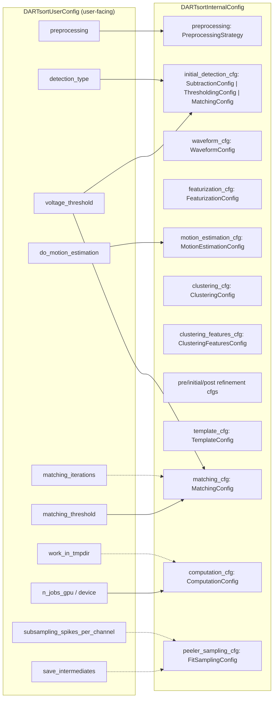

### Reverse Mapping: InternalConfig → UserConfig

For AI agents reading code that references internal config fields:

| Internal Config Field | Controlled By (UserConfig) |
|----------------------|---------------------------|
| `clustering_cfg.min_cluster_size` | Set within `clustering_cfg` sub-config or defaults |
| `initial_detection_cfg` | `detection_type` + `voltage_threshold` + `peak_sign` |
| `matching_cfg.matching_threshold` | `matching_threshold` |
| `computation_cfg.n_jobs_gpu` | `n_jobs_gpu` |
| `computation_cfg.device` | `device` |
| `featurization_cfg.do_localization` | `do_localization` or defaults |
| `motion_estimation_cfg.do_motion_estimation` | `do_motion_estimation` |
| `peeler_sampling_cfg` | `subsampling_spikes_per_channel` + `subsampling_presence` |

### Config Flag Interdependencies

#### Early Exit Flags

| Flag | Effect | Code Reference |
|------|--------|---------------|
| `detect_only` | Exits after Step 1 (initial detection) | `main.py:273-275` |
| `dredge_only` | Exits after motion estimation | `main.py:296-298` |
| `matching_iterations == 0` | Skips matching entirely (unusual) | Loop range becomes empty |

#### Behavioral Flags

| Flag | Effect | Interactions |
|------|--------|-------------|
| `final_refinement` | Whether to cluster after the final matching step | Controls early exit at `main.py:378-379` |
| `recluster_after_first_matching` | Run clustering after matching step 1 | Interacts with `_matching_step_cfgs()` |
| `is_subsampling` | Computed from `subsampling_spikes_per_channel` + `subsampling_presence != 1.0` | Affects `_matching_step_cfgs()` output: final+subsampling+TMM → 1 refinement pass |

#### Resume Flags

| Flag | Effect | Description |
|------|--------|-------------|
| `link_from` | Resume from benchmark directory | Symlinks files from another output directory |
| `link_step` | Which step to link from | Used with `link_from` for benchmarking |
| `save_intermediate_labels` | Save `refined{N}_labels.npy` at each step | Enables finer-grained checkpoint resume |
| `save_intermediate_features` | Save .h5 files at each step | Preserves intermediate feature data |

#### Performance Flags

| Flag | Effect | Description |
|------|--------|-------------|
| `work_in_tmpdir` | Use scratch directory (`main.py:135-180`) | Avoids network filesystem overhead |
| `subsampling_spikes_per_channel` | Subsample for speed | Limits spike count per channel in non-final steps |
| `subsampling_presence` | Coverage requirement when subsampling | Default `1.0` means full coverage |
| `chunk_length_samples` | Processing chunk size | Controls memory usage vs. overhead tradeoff |

#### Output Flags

| Flag | Effect | Description |
|------|--------|-------------|
| `save_everything_on_error` | Copy tmpdir contents on crash | Debugging aid (`main.py:168-179`) |

---

## 5. Data Flow & Storage

### HDF5 File Structure

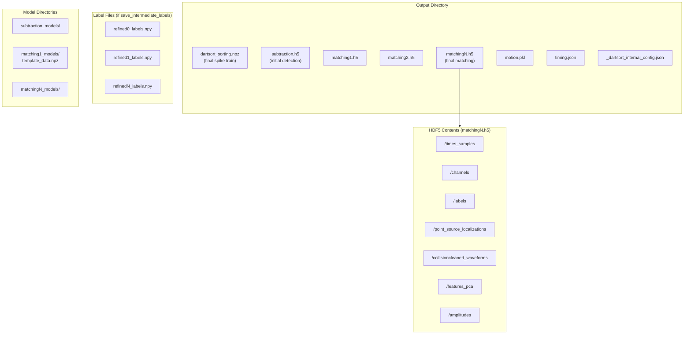

### DARTsortSorting Class

The core data structure (`util/data_util.py`) holds:

| Field | Type | Description |
|-------|------|-------------|
| `times_samples` | `int64[n_spikes]` | Spike times in samples |
| `channels` | `int32[n_spikes]` | Max channel per spike |
| `labels` | `int32[n_spikes] \| None` | Unit assignments (None before clustering) |
| `parent_h5_path` | `Path` | Path to HDF5 with features |

Features are lazily loaded from HDF5 on access: `point_source_localizations`, `amplitudes`, `collisioncleaned_waveforms`, etc.

#### Nested Type Graph

- `DARTsortSorting` → lazy-loads from HDF5
- `TemplateData` → contains `LowRankTemplates` and `CompressedUpsampledTemplates`
- `DARTsortInternalConfig` → 6+ levels of nested config dataclasses

### Intermediate Output Lifecycle

1. **Created during pipeline:** `subtraction.h5`, `matching{N}.h5`, `refined{N}_labels.npy`, `*_models/` directories
2. **Kept after pipeline:** Only the final `matchingN.h5` and `dartsort_sorting.npz` (unless `save_intermediate_features` is set)
3. **Deleted by:** `ds_handle_delete_intermediate_features()` (`main.py:410`)

---

## 5b. Checkpoint/Resume Logic

### `ds_fast_forward()` Algorithm

This function determines where pipeline execution should resume. Reference: `main_util.py`, invoked at `main.py:226`.

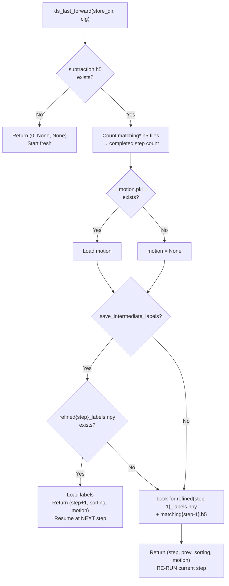

#### Algorithm Steps

1. Look for `subtraction.h5` — if missing, return `(0, None, None)` (start fresh).
2. Look for `matching*.h5` files — file count determines completed step number.
3. Load motion from `motion.pkl` if it exists.
4. If `cfg.save_intermediate_labels`:
   - Look for `refined{step}_labels.npy`
   - If found, load labels and return `(step + 1, sorting_with_labels, motion)` — resume at NEXT step
5. Otherwise:
   - Look for `refined{step-1}_labels.npy` and `matching{step-1}.h5`
   - Return `(step, previous_sorting, motion)` — RE-RUN current step

> **Critical invariant:** Without `save_intermediate_labels=True`, fast-forward can only resume at matching steps, not after clustering. A crash during clustering without intermediate labels forces re-running from the last matching step.

---

## 6. Design Patterns

### 1. Peeler Pattern

All detection methods inherit from a base peeler interface:

```python
class BasePeeler:
    def peel(self, traces, ...) -> detections
    def load_or_fit_and_save_models(self, ...)
    @classmethod
    def from_config(cls, ...) -> Self
```

Implementations: `Threshold`, `SubtractionPeeler`, `ObjectiveUpdateTemplateMatchingPeeler`. All are orchestrated through `run_peeler()` (`peel_util.py:20-152`), which handles model loading, chunked processing, feature extraction, and HDF5 output.

### 2. Transformer Pipeline

`WaveformPipeline` (`transform/pipeline.py`) chains transformers, each with `.fit()`, `.transform()`, and `.fit_transform()` methods:

```python
pipeline = WaveformPipeline([
    Whitener(...),
    TemporalPCA(...),
    AmortizedLocalization(...),
    DimensionalityReduction(...)
])
transformed = pipeline.transform(waveforms)
```

Each transformer inherits from `transform_base.py`. New transforms can be added by implementing the interface and adding to the pipeline list.

### 3. HDF5 Lazy Loading

`DARTsortSorting` lazily loads features from HDF5 when accessed:

```python
# Features not loaded until accessed
sorting = DARTsortSorting.from_peeling_hdf5("matching1.h5")
# First access triggers HDF5 read
locs = sorting.point_source_localizations  # lazy load
```

This keeps memory usage low — only the requested features are loaded.

### 4. Config Dataclass Hierarchy

All configuration via dataclasses with type checking, default values, serialization to TOML/JSON, and validation:

```
DARTsortUserConfig (user-facing, high-level)
  ↓ to_internal_config()
DARTsortInternalConfig
  ├── preprocessing: PreprocessingStrategy
  ├── waveform_cfg: WaveformConfig
  ├── featurization_cfg: FeaturizationConfig
  ├── initial_detection_cfg: SubtractionConfig | ...
  ├── clustering_cfg: ClusteringConfig
  ├── template_cfg: TemplateConfig
  ├── matching_cfg: MatchingConfig
  ├── computation_cfg: ComputationConfig
  └── ... (12+ sub-configs)
```

### 5. Motion-Aware Processing

Many operations accept a `motion` parameter that adjusts spatial coordinates based on drift:

```python
localize_spikes(waveforms, geom, motion=motion_info)
cluster(sorting, motion=motion, ...)
match(sorting, motion=motion, ...)
```

Motion is carried through the entire pipeline after estimation. All feature extraction, clustering, and template operations can correct for drift.

---

## 7. Control Flow Decisions

### Master Decision-Point Flowchart

All conditional branches in `_dartsort_impl()` (`main.py:204-419`):

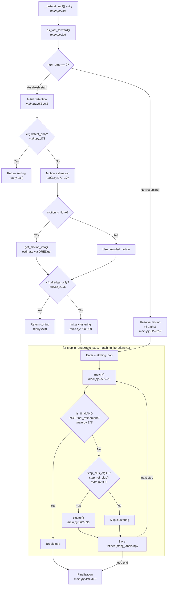

### Workflow Sequences

#### Full Pipeline Execution (Normal Path)

1. Config conversion: `to_internal_config()`
2. Preprocessing: `preprocess()` (`main.py:133`)
3. Optional tmpdir setup (`main.py:135-146`)
4. Fast-forward check: `ds_fast_forward()` → `next_step=0`
5. Initial detection: `initial_detection()` (`main.py:258-268`)
6. Motion estimation: `get_motion_info()` (`main.py:277-294`)
7. Initial clustering: `cluster()` (`main.py:300-328`)
8. Matching loop (steps 1..N): match → recluster → repeat
9. Finalization: save sorting, cleanup (`main.py:404-419`)

#### Resume-from-Checkpoint Sequence

1. `ds_fast_forward()` finds existing files → `next_step=N`
2. Motion resolution from 4 paths (`main.py:227-252`)
3. Skip to matching loop at step N
4. Continue from there normally

#### Subsampling Workflow

1. `is_subsampling` computed from `subsampling_spikes_per_channel` + `subsampling_presence` (`main.py:255-256`)
2. Non-final steps: `stop_after_n_spikes = spk_per_chan * n_channels`, `ensure_coverage = subsampling_presence`
3. Final step: always full coverage (`_nspk=None`, `_pres=1.0`)
4. `_matching_step_cfgs()` adjusts refinement: final+subsampling+TMM → single agglomerate pass

#### Motion Estimation Bypass (User-Provided Motion)

1. User passes `motion=MotionInfo(...)` to `dartsort()`
2. `_dartsort_impl()` receives it, sets `motion` directly (`main.py:227-228`)
3. Internal estimation via `get_motion_info()` is skipped entirely
4. `ds_save_motion()` still saves the provided motion to disk (`main.py:294`)

### Error Handling Paths

#### Error Trapping with Traceback Saving

Both tmpdir and non-tmpdir paths wrap `_dartsort_impl()` in try/except (`main.py:151-180` and `main.py:184-201`):

1. On exception: write traceback to `output_dir/traceback.txt`
2. If `cfg.save_everything_on_error` and using tmpdir: copy entire tmpdir contents to `output_dir/error_state/`
3. If not saving: log warning that files won't be kept
4. Re-raise the exception

#### Tmpdir Cleanup

- **On success:** Files are already copied to `output_dir` during pipeline. Tmpdir is cleaned up by `TemporaryDirectory` context manager.
- **On error without `save_everything_on_error`:** Tmpdir is cleaned up, all intermediate data is lost.
- **On error with `save_everything_on_error`:** Tmpdir contents copied to `error_state/` before cleanup.

---

## 8. AI Guidance

### Canonical Terminology Glossary

| Term | Definition |
|------|-----------|
| **spike** | A single detected extracellular voltage deflection from a neuron firing. Identified by a time (in samples) and a channel (max amplitude). |
| **unit** | A cluster of spikes attributed to the same neuron. Identified by an integer label. |
| **template** | The mean waveform of a unit across channels. Used as a spatial-temporal fingerprint for matching. |
| **peeler** | A detection method that "peels" spikes from traces. Implements `peel()` to detect and optionally subtract matched spikes. |
| **waveform** | A voltage snippet extracted around a detected spike peak. Shape: `[n_time, n_channels]`. |
| **cluster** | A group of spikes with similar features, representing a putative unit. Produced by GMM or other clustering algorithms. |
| **drift / motion** | Physical displacement of the recording probe relative to the brain over time. Tracked as vertical displacement per time bin. |
| **residual** | The recording trace after subtracting all matched templates. Used for iterative detection of remaining spikes. |
| **sorting** | A `DARTsortSorting` object holding spike times, channels, labels, and a reference to HDF5 features. |
| **matching iteration** | One cycle of template estimation → template matching → reclustering in the matching loop. |
| **refinement pass** | A split/merge operation applied to clusters to improve unit separation. Multiple passes run in sequence. |
| **TSVD** | Truncated SVD. Used to compress templates for efficient storage and matching. |
| **PTP** | Peak-to-peak amplitude. The difference between max and min voltage in a waveform. |
| **SNR** | Signal-to-noise ratio. Template amplitude relative to noise standard deviation. |
| **DREDge** | External library for decentralized registration and estimation of drift in electrophysiology. |

### Module Dependency Map

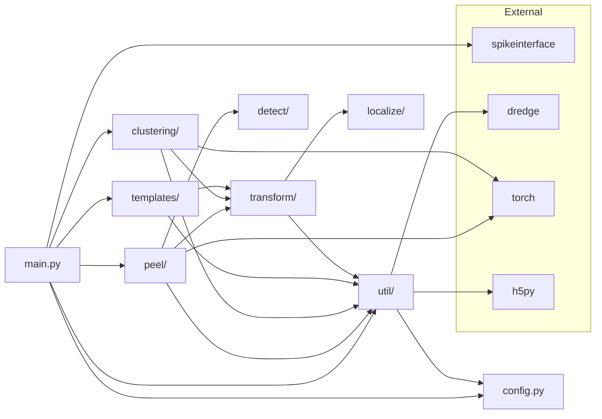

### Refactoring Targets

Identified from codebase analysis:

- **Uninstrumented modules** (0 log statements):
  - `peel/peel_lib.py` (9 functions)
  - `clustering/clustering.py` (30 functions)
  - `peel/subtract.py` (12 functions)
  - `peel/grab.py` (5 functions)
  - `localize/localize_torch.py` (6 functions)

- **Complex config hierarchy:** User → Internal config conversion is opaque. 12+ sub-configs with 6+ levels of nesting.
- **Documentation gaps:** No high-level architecture diagram in repo (this document fills that gap).
- **Error messages:** Many internal exceptions could be more user-friendly.

### Known Limitations

- Motion estimation assumes primarily vertical drift; complex 3D motion patterns are not modeled.
- Neural-net localization is trained on simulated data; accuracy may vary for non-standard probe geometries.
- Checkpoint resume without `save_intermediate_labels` can only resume at matching steps, not mid-clustering.
- Template matching threshold is global; per-unit adaptive thresholds are not supported.

---

## 8b. Design Invariants

These constraints **must be preserved** in any refactoring. Violating them will produce incorrect results or break the pipeline.

> **1. Resume semantics:** Without `save_intermediate_labels=True`, fast-forward can only resume at matching steps, not after clustering. Any refactor that changes the matching loop iteration structure must preserve the file-naming convention (`matching{N}.h5`, `refined{N}_labels.npy`) or update `ds_fast_forward()` accordingly.

> **2. Motion before clustering:** Motion estimation must complete before clustering — spatial correction is required before feature extraction. Moving clustering before motion estimation will produce incorrect results.

> **3. SVD compression before matching:** Templates must be SVD-compressed before template matching. This is a memory/performance invariant. The matching peeler (`ObjectiveUpdateTemplateMatchingPeeler`) expects `LowRankTemplates`.

> **4. Refinement config ordering:** `pre_refinement_cfg` → `initial_refinement_cfg` → `post_refinement_cfgs` must execute in this order. The pre-refinement prepares data for initial refinement, and post-refinement(s) clean up afterward. Reference: `main.py:301-305`.

> **5. Peeler lifecycle:** `load_or_fit_and_save_models()` must be called before `peel()`. Models are lazily loaded/fitted on first use, then cached to disk for resume. Reference: `peel_util.py:83-88`.

> **6. HDF5 path consistency:** `sorting.parent_h5_path` must point to the correct output directory after tmpdir cleanup. The finalization step (`main.py:405-409`) patches this path. Breaking this causes feature access to fail after pipeline completion.

> **7. Config immutability during execution:** `DARTsortInternalConfig` is frozen after `to_internal_config()` converts the user config. Internal config fields should not be mutated during pipeline execution.

> **8. Label file naming convention:** `refined{N}_labels.npy` where N corresponds to the matching step index. Breaking this convention breaks `ds_fast_forward()`. Reference: `main.py:319-325` and `main.py:396-402`.
